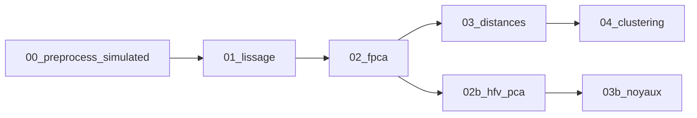

# Rapport détaillé — Expérience 03 (données simulées hybrides)

**Version du document** : mars 2026  
**Référence code** : [`benchmark_all_methods_simulated.R`](benchmark_all_methods_simulated.R), [`src/00_preprocess_simulated.R`](../../src/00_preprocess_simulated.R)  
**Résultats numériques** : extraits de [`results/`](results/) (dernier benchmark avec **`P_Z_SIM = 20`** par défaut).

---

## 1. Synthèse exécutive

- **Objectif** : comparer, sur données **fonctionnelles + vectorielles** simulées avec vérité terrain, plusieurs familles de méthodes de clustering (distances, stratégies historiques A/B/C, chaîne **HFV-PCA + noyaux** `02b` → `03b`).
- **Design** : générateur **`Cas2_deriv`** ; **4 scénarios** de signal (paramètres `delta`) × **50 graines** par scénario ; **`p = 20`** variables vectorielles ; **K = 3** classes.
- **Évaluation** : **ARI** (accord avec les classes simulées) et **silhouette** (cohérence sur la distance utilisée). **Règle projet** : l’ARI **ne sert jamais** au choix des hyperparamètres (`α`, `ω`, etc.) — uniquement à l’évaluation post hoc.
- **Résultats clés (moyennes globales sur les 200 runs, 8 méthodes)** :
  - **Meilleur ARI moyen** : **`C_DK_ancien`** ≈ **0.651** ; puis **`D1`** ≈ **0.626** ; **`DK_reconstruit`** ≈ **0.608**.
  - La chaîne **`DK_reconstruit`** se place **clairement au-dessus** des baselines **`B_silopt` / `Df_silopt`** en moyenne (~0.555) et de **`A`** (~0.561), mais **sous** la stratégie C historique en moyenne globale.
  - **Scénarios faciles (S1, S2)** : `C_DK_ancien` et **`DK_reconstruit`** dominent ; **S3** : méthodes vectorielles / simples (`A`, `Ds`) remontent en tête ; **S4** (signal très faible) : toutes les méthodes se dégradent — **`D1`** mène en ARI moyen, partitions très confuses (voir §7.3).
- **Silhouette** : souvent **plus élevée** pour `B_silopt` / `Df_silopt` (~0.29) que pour `C_DK_ancien` / `DK_reconstruit` (~0.12–0.13) — **paradoxe silhouette vs ARI** documenté dans le projet.

---

## 2. Nature du problème et justification

### 2.1 Problème de clustering hybride

On observe pour chaque individu :

- une **courbe** (signal fonctionnel discrétisé) ;
- un **vecteur** `Z` de covariables.

Le clustering doit exploiter **à la fois** la forme (niveau, dérivée via le générateur), le **mélange** fonctionnel/vectoriel dans les distances, ou une **représentation fusionnée** (ACP hybride) avant noyaux.

### 2.2 Pourquoi une étude simulée (expérience 03)

- **Contrôle** : `n`, `K`, bruit (`σ²`, `τ²`), séparation des classes sur la courbe et sur `Z`, avec **réplication** (50 seeds).
- **Vérité terrain** : pour calculer l’**ARI** sans biais de protocole.
- **Complément** aux expériences sur données réelles (Canadian, etc.) : où la silhouette et l’ARI peuvent diverger et où l’**optimisation** des paramètres ne peut pas s’appuyer sur l’ARI.

### 2.3 Lien avec la vision du projet

Voir [`STATE_OF_PROJECT.md`](../../STATE_OF_PROJECT.md) : paradoxe **silhouette / ARI**, rôle des **dérivées** dans le signal fonctionnel, et distinction **`ω`** (distance `Dw`) vs **`r`** (pondération HFV en 02b).

---

## 3. Données simulées : générateur `Cas2_deriv`

**Implémentation** : [`docs/biblio/notes/RE_Lectures_ACP_hybride/simulations.R`](../../docs/biblio/notes/RE_Lectures_ACP_hybride/simulations.R).  
**Entrée pipeline** : [`src/00_preprocess_simulated.R`](../../src/00_preprocess_simulated.R).

### 3.1 Mécanisme

| Bloc | Description |
|------|-------------|
| **Fonctionnel** | Base trigonométrique `Psi` (10 fonctions), coefficients de classe `coef_mu`. Les indices **1–2** (courbe) sont multipliés par `delta[1]`, **3–4** (dérivée) par `delta[2]` ; indices **5–10** neutres. |
| **Latent** | `Rho` (coefficients aléatoires) → `X_obs` = signal + bruit gaussien `sigma2`. |
| **Vectoriel** | `Y = Rho Θ' + μ_Y` + bruit `tau2` ; les moyennes de classe `μ_Y` sont **dimensionnées** par `delta[3]`. |
| **Tailles** | `n = 300` (100 par classe), `N = 60` points temporels, **`p = P_Z_SIM`** (défaut **20**). |
| **Bruit (benchmark)** | `SIGMA2_SIM = 0.2`, `TAU2_SIM = 0.2`. |

### 3.2 Scénarios (`DELTA_SIM`)

Le benchmark fixe `DELTA_SC = (delta1, delta2, delta3)` :

| ID | (δ₁, δ₂, δ₃) | Interprétation |
|----|----------------|----------------|
| **S1** | (1, 1, 1) | Signal **fort** fonctionnel + vectoriel. |
| **S2** | (1, 1, 0.5) | Même fonctionnel que S1 ; **signal vectoriel affaibli** (demi-écart entre classes sur `Z`). |
| **S3** | (0.5, 0.5, 1) | **Fonctionnel affaibli** (courbe + dérivée) ; vectoriel fort. |
| **S4** | (0.5, 0.5, 0.5) | **Affaiblissement global** (courbe, dérivée, vectoriel). |

### 3.3 Diagnostics QC (seed 42, `p = 20`)

Fichier `results/qc_simulated_scenarios.csv` :

| Scénario | Δ (colonnes delta1, delta2) | PVE PC1 | PVE cumul. (K comp.) | VF_trace | VY_trace | r_théorique | \|corr\| moy. η–Z |
|----------|-----------------------------|---------|----------------------|----------|----------|-------------|-------------------|
| S1 | 1 / 1 | 0.624 | 0.975 | 130.52 | 20 | 6.53 | 0.261 |
| S2 | 1 / 0.5 | 0.624 | 0.975 | 130.52 | 20 | 6.53 | 0.251 |
| S3 | 0.5 / 1 | 0.399 | 0.960 | 72.36 | 20 | 3.62 | 0.247 |
| S4 | 0.5 / 0.5 | 0.399 | 0.960 | 72.36 | 20 | 3.62 | 0.233 |

*Remarques* : `VY_trace = tr(Cov(Z_std)) = p` pour `Z` standardisé dans ce diagnostic ; `r_theorique = VF/VY` donne un ordre de grandeur du **poids relatif** variance fonctionnelle / vectorielle. S3 et S4 réduisent fortement la variance expliquée FPCA (PC1 plus bas).

---

## 4. Pipeline logiciel



- **Branche principale** (`00` → `04`) : lissage splines, FPCA, matrices de distances `D0`, `D1`, `Ds`, `Dp`, noyaux, puis stratégies **A** (k-means), **B** (PAM sur `Dw(α,ω)`), **C** (PAM sur `DK(α)`).
- **Branche** `02b` → `03b` : ACP hybride **HFV** puis distance noyau sur courbes reconstruites + vecteur.

### 4.1 Étape 02b (implémentation actuelle)

Fichier [`src/02b_pca_hybride_reconstruction.R`](../../src/02b_pca_hybride_reconstruction.R) :

1. **η** = scores FPCA (étape 02).
2. **Z_std** = `scale(Z)` ; **ACP** sur `Z_std` → scores **γ** (`gamma`), dimension **J** (variance cumulée ≥ 95 %, plafond).
3. **V_F** = tr(Cov(η)), **V_Y** = tr(Cov(**γ**)).
4. **r** = V_F / V_Y ; **γ_pond** = √r · γ ; **χ** = [η | γ_pond].
5. ACP sur χ → **ρ** ; reconstruction L² des courbes.

### 4.2 Étape 03b

[`src/03b_distances_noyaux_hybrides.R`](../../src/03b_distances_noyaux_hybrides.R) : distance sur les **reconstructions** + combinaison avec un noyau sur **Z** (standardisé), puis matrice de distances `D_K` pour PAM.

---

## 5. Méthodes comparées (noms CSV)

| Nom CSV | Description courte |
|---------|-------------------|
| `D0`, `D1`, `Ds` | PAM sur distance de niveau, de forme, ou jointe (voir étape 03). |
| `Df_silopt` | PAM sur `Df(α) = Dp(α)` (mélange fonctionnel) ; **α** choisi par **silhouette** sur grille 0…1. |
| `A` | k-means sur [scores FPCA \| Z standardisé]. |
| `B_silopt` | PAM sur **Dw(α,ω)** ; **(α,ω)** par **silhouette** sur grille ([`04_clustering.R`](../../src/04_clustering.R)). |
| `C_DK_ancien` | PAM sur noyau `DK(α)` ; **α** par silhouette. |
| `DK_reconstruit` | `02b` → `03b` ; colonne **`r`** = ratio HFV (≠ **`ω`**). |

**Métriques** :

- **ARI** : entre partition et classes simulées.
- **Silhouette** : sur la distance utilisée par la méthode.

**Règle** : pas de sélection d’hyperparamètres par **maximisation de l’ARI** sur les grilles (retirée du benchmark).

---

## 6. Protocole expérimental et reproductibilité

| Paramètre | Valeur |
|-----------|--------|
| Seeds par scénario | `1:50` |
| Matrices de confusion | seed **42** (`SEED_REF_CONF`) |
| `P_Z_SIM` | **20** (défaut) |
| `NC_SIM` | `c(100,100,100)` |
| `LEN_T_SIM` | 60 |
| `SIGMA2_SIM`, `TAU2_SIM` | 0.2 |

**Commandes** :

```bash
Rscript experiments/03_simulated_hybride/qc_simulated_data.R
Rscript experiments/03_simulated_hybride/benchmark_all_methods_simulated.R
Rscript src/02b_pca_hybride_reconstruction.R   # smoke test simulé
```

**Sorties** : liste des CSV dans [`PROTOCOLE_SORTIES.md`](PROTOCOLE_SORTIES.md) ; rapport console via [`emettre_rapport_sorties.R`](emettre_rapport_sorties.R).

---

## 7. Résultats

### 7.1 Moyennes globales (tous scénarios et seeds)

Fichier `results/metrics_global_average_by_method.csv` :

| Méthode | ARI moyen | Silhouette moyenne |
|---------|-----------|--------------------|
| C_DK_ancien | 0.651 | 0.126 |
| D1 | 0.626 | 0.257 |
| DK_reconstruit | 0.608 | 0.118 |
| A | 0.561 | 0.134 |
| B_silopt | 0.555 | 0.287 |
| Df_silopt | 0.555 | 0.287 |
| D0 | 0.528 | 0.256 |
| Ds | 0.414 | 0.116 |

*(Ordre décroissant ARI.)*

### 7.2 Classement par scénario (ARI moyen)

Source : `results/ranking_by_scenario.csv`.

| Rang | S1 (top 3) | S2 (top 3) | S3 (top 3) | S4 (top 3) |
|------|------------|------------|------------|------------|
| 1 | C_DK_ancien (0.938) | C_DK_ancien (0.887) | A (0.623) | D1 (0.378) |
| 2 | DK_reconstruit (0.897) | B_silopt / D1 / Df (0.873) | Ds (0.511) | C_DK_ancien (0.317) |
| 3 | B_silopt / D1 / Df (0.873) | … | C_DK_ancien (0.461) | A (0.315) |

- **S1–S2** : scores très élevés pour les méthodes qui exploitent bien le **noyau fonctionnel** (C, DK reconstruit, `D1`/`Df`/`B`).
- **S3** : le signal fonctionnel faible favorise **`A`** (vecteur + scores) et **`Ds`** ; `B_silopt` / `Df_silopt` **chutent** (ARI ~0.24).
- **S4** : ARI moyens **bas** pour toutes les méthodes ; **`D1`** devient le meilleur en moyenne — le problème est **difficile** et les partitions sont peu alignées aux classes.

### 7.3 Exemples qualitatifs (matrices de confusion, seed 42)

- **S1 — `C_DK_ancien`** (`confusion_S1_C_DK_ancien.csv`) : partition quasi parfaite (erreurs mineures entre clusters 1 et 2 sur C1/C2).
- **S4 — `DK_reconstruit`** (`confusion_S4_DK_reconstruit.csv`) : forte **confusion** entre les trois clusters (ex. nombreux individus C2/C3 mélangés entre clusters 2 et 3) — cohérent avec un ARI moyen faible sur S4.

### 7.4 Régénération des tableaux

Pour mettre à jour les chiffres après un nouveau run :

```r
read.csv("experiments/03_simulated_hybride/results/metrics_global_average_by_method.csv")
read.csv("experiments/03_simulated_hybride/results/ranking_by_scenario.csv")
```

---

## 8. Discussion

1. **Paradoxe silhouette / ARI** : les méthodes `B_silopt` et `Df_silopt` affichent des **silhouettes** élevées mais **pas** les meilleurs ARI en moyenne — la silhouette optimise la **géométrie de la distance choisie**, pas la récupération des classes simulées.
2. **`C_DK_ancien` vs `DK_reconstruit`** : la stratégie C reste **très compétitive** sur S1–S2 ; `DK_reconstruit` est **proche** (surtout S1) et reste au-dessus de nombreuses baselines sur la moyenne globale, sans **tuner** par ARI.
3. **Limites** : un seul générateur, **`p` fixé** (20), grilles discrètes, **k connu** pour PAM, pas de sélection de `K`.
4. **Perspectives** : sensibilité `p = 30`, autres `delta`, critères internes sans label (stabilité, etc.).

---

## 9. Annexes

| Ressource | Rôle |
|-----------|------|
| [`PROTOCOLE_SORTIES.md`](PROTOCOLE_SORTIES.md) | Fichiers CSV, définitions KPI, `P_Z_SIM`. |
| [`results/SYNTHESE_BENCHMARK_SIMULE.md`](results/SYNTHESE_BENCHMARK_SIMULE.md) | Synthèse courte + lien vers ce rapport. |
| [`NOTE_RS_PCA_VS_HFV_PCA.md`](NOTE_RS_PCA_VS_HFV_PCA.md) | Nomenclature **ω** / **r**, positionnement RS vs HFV. |
| [`emettre_rapport_sorties.R`](emettre_rapport_sorties.R) | Rapports texte en fin de script. |

---

*Document généré selon le plan « Rapport détaillé — Expérience 03 » ; aligné sur l’implémentation actuelle de `02b` (ACP sur `Z_std`, scores γ, r = V_F/V_Y sur γ).*
